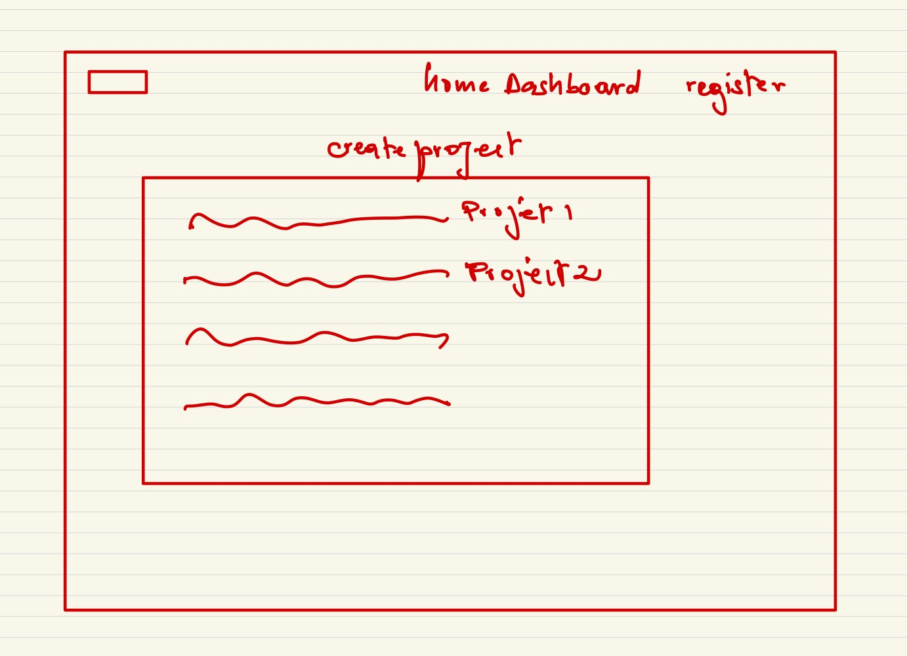
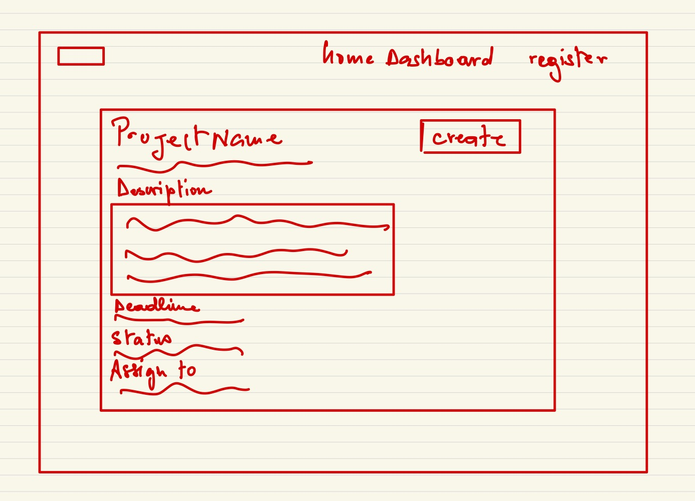
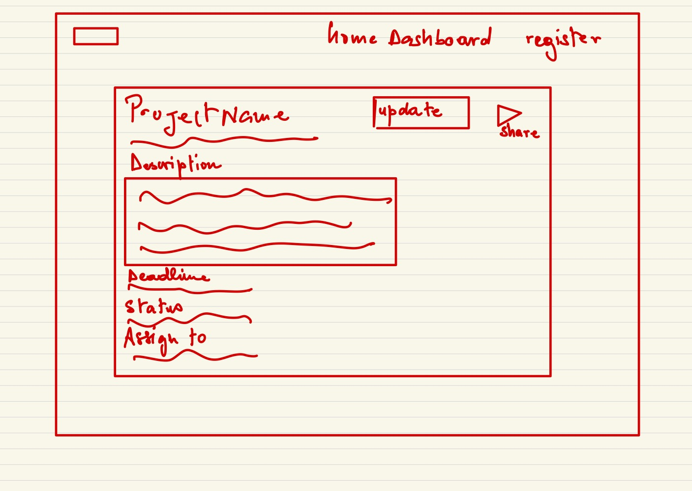

# Project Dashboard

## Overview

Managing multiple projects simultaneously can be overwhelming, with details scattered across different tools and platforms. That's where Project Dashboard comes in!

Project Dashboard is a web application that helps users organize and track their projects in one centralized location. Users can register and login to create, view, and manage their projects. Each project can contain key information such as deadlines, progress updates, and important notes. Users can also share project details via email, making collaboration easier. The dashboard provides a clear overview of all ongoing projects, helping users stay on top of their commitments and deadlines.

## Data Model

The application will store Users, Projects, and Tasks

* users can have multiple projects (via references)
* each project can have multiple tasks (by embedding)
* each project can have multiple collaborators (via references to Users)

An Example User:

```javascript
{
  username: "projectmaster",
  hash: // a password hash,
  email: "example@email.com",
  projects: // an array of references to Project documents
}
```

An Example Project with Embedded Tasks:

```javascript
{
  user: // a reference to a User object
  title: "Website Redesign",
  description: "Complete overhaul of company website",
  startDate: // timestamp,
  deadline: // timestamp,
  status: "In Progress", // ["Not Started", "In Progress", "Completed", "On Hold"]
  priority: "High", // ["Low", "Medium", "High"]
  collaborators: // array of references to User objects
  tasks: [
    { 
      name: "Design mockups", 
      description: "Create initial design mockups",
      deadline: // timestamp,
      status: "completed",
      assignedTo: // reference to a User object
    },
    { 
      name: "Frontend development",
      description: "Implement responsive design",
      deadline: // timestamp,
      status: "in-progress",
      assignedTo: // reference to a User object
    }
  ],
  createdAt: // timestamp
}
```

## [Link to Commented First Draft Schema](db.js) 

## Wireframes

/dashboard - main page showing all projects



/project/create - page for creating a new project



/project/:id - page for showing specific project details



## Site map

```
├── Home
├── Login
├── Register
├── Dashboard
│   └── Project Details
│       ├── Edit Project
│       └── Share Project
└── Create Project
```

## User Stories or Use Cases

1. as non-registered user, I can register a new account with the site
2. as a user, I can log in to the site
3. as a user, I can create a new project with details like title, description, deadline
4. as a user, I can view all of my projects in a dashboard view
5. as a user, I can click on a project to view its full details
6. as a user, I can add tasks to an existing project
7. as a user, I can mark tasks as complete/incomplete
8. as a user, I can share project details via email
9. as a user, I can edit project details
10. as a user, I can filter and sort projects by status, priority, or deadline

## Research Topics

* (3 points) Integrate user authentication
    * I'm going to be using email for user authentication
    * Will also implement OAuth 2.0 for Google login integration
* (5 points) Email Integration
    * Will use Nodemailer for sending project sharing emails
    * Will implement email templates for professional-looking notifications
* (3 points) Client-side form validation using a JavaScript library
    * Will use Yup or Zod for form validation
    * Will ensure proper validation of dates, required fields, and email formats

11 points total out of 10 required points

## [Link to Initial Main Project File](app.js) 

## Annotations / References Used

1. [Nodemailer documentation](https://nodemailer.com/about/)
2. [Yup documentation](https://github.com/jquense/yup)
